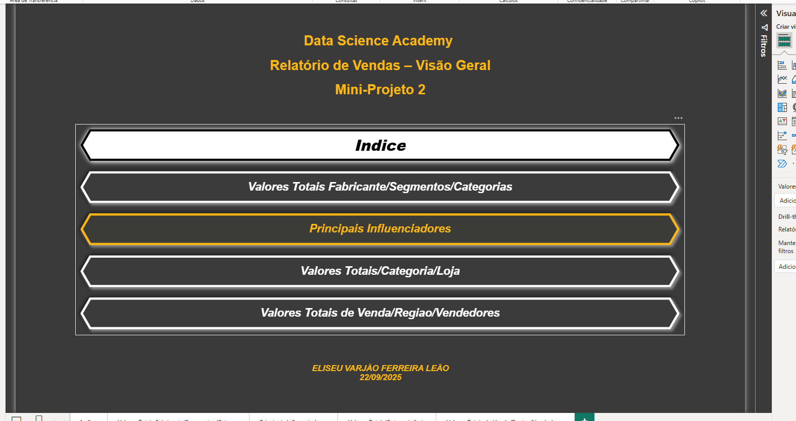
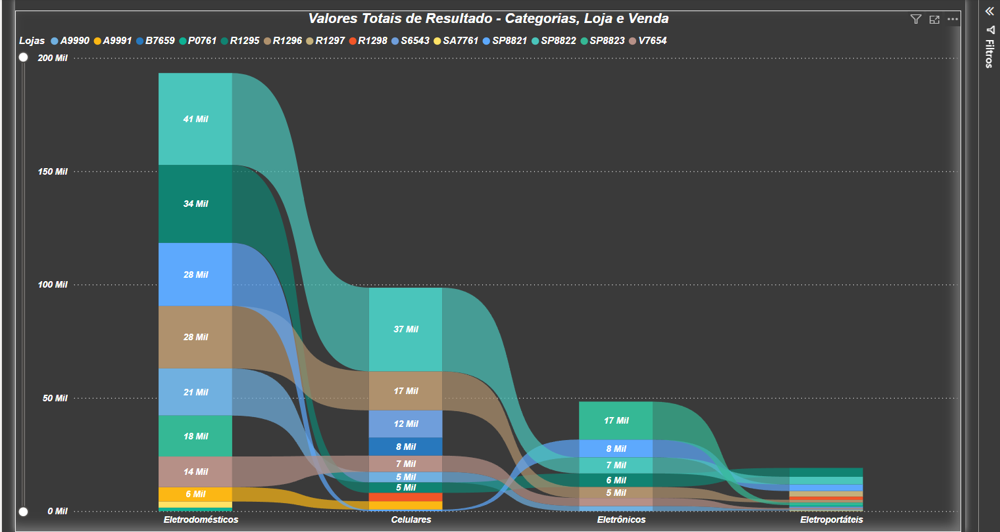
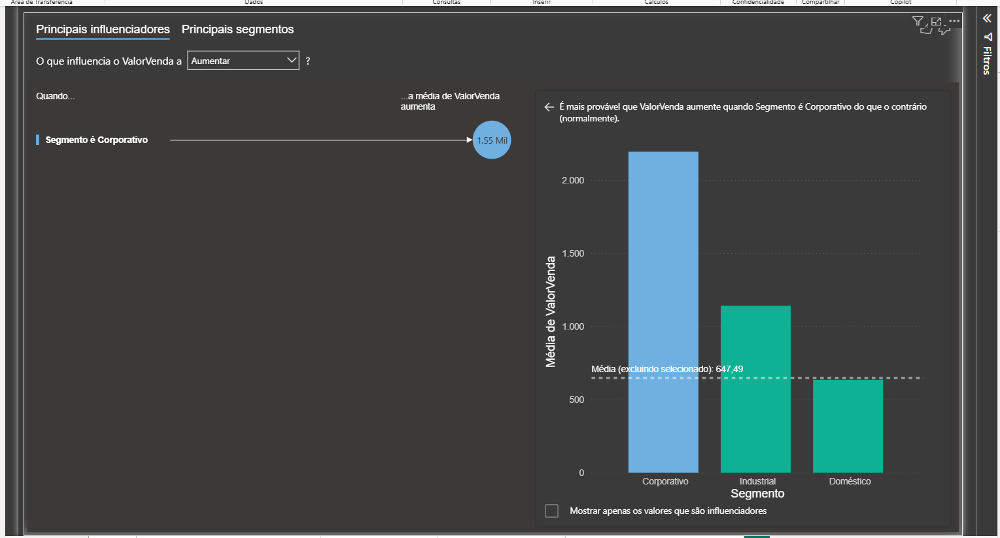
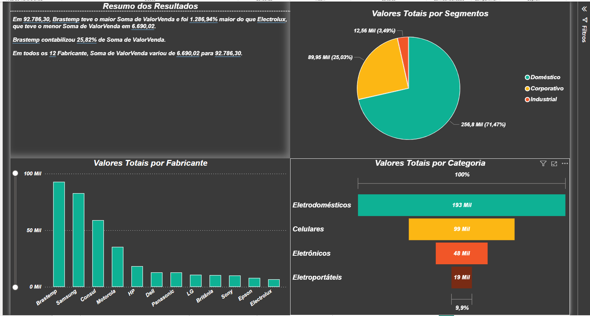

# 📊 Dashboard de Vendas - Power BI

Dashboard desenvolvido em Power BI para análise de vendas, segmentos, categorias e fabricantes.

---

## 📌 Funcionalidades

- Análise de fabricantes
- Análise por segmentos
- Influenciadores principais
- Sankey Chart
- Indicadores de vendas
- KPIs
- Storytelling visual

---

## 🛠️ Tecnologias Utilizadas

- Power BI
- DAX
- Power Query

---

## 🖼️ Imagens do Projeto

### Índice

### Indicadores

### Influenciadores

### Valores Totais

---

## 👨‍💻 Desenvolvido por

Eliseu Varjão
